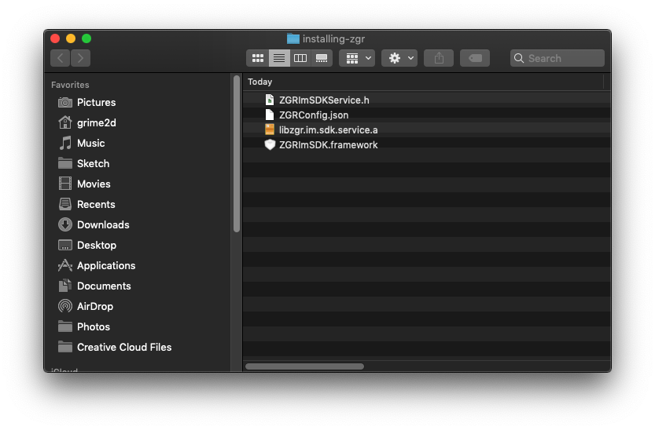
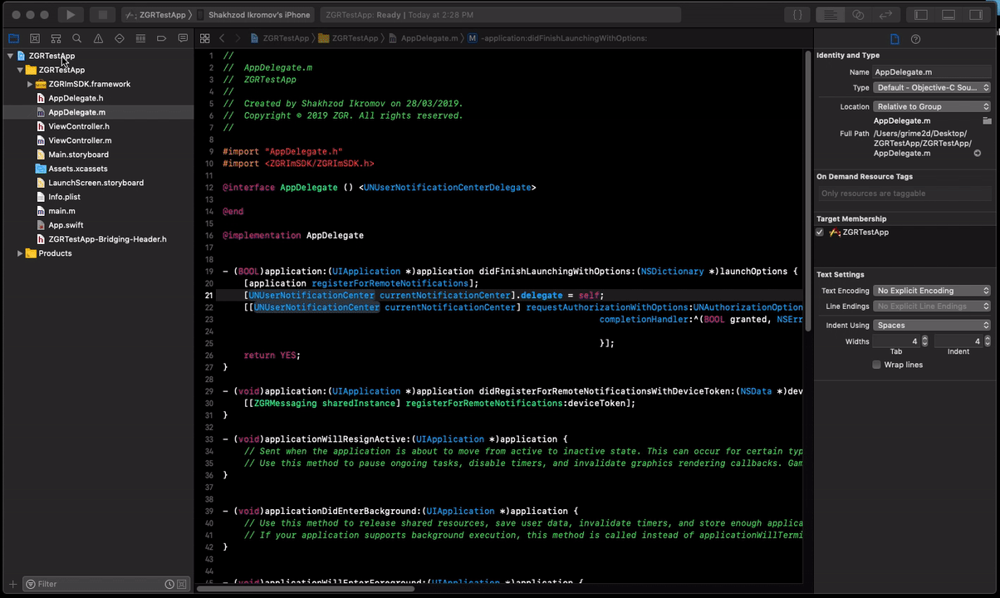

# Installation instructions for customers

## Setup

1. Make sure, that you have all required frameworks and config files from ZGR.



2. Open Xcode and install framework to your app by drag and drop, check "Copy items if needed".
    * Be sure that the framework is embedded to your app


3. In `AppDelegate` include ZGR

Objective-C:

```
#import <ZGRImSDK/ZGRImSDK.h>
```
   
Swift:

```
import ZgrImSDK
```

4. Register your app for remote notifications and send token to ZGR

Objective-C:

```
- (BOOL)application:(UIApplication *)application didFinishLaunchingWithOptions:(NSDictionary *)launchOptions {
    [application registerForRemoteNotifications];
    return YES;
}

- (void)application:(UIApplication *)application didRegisterForRemoteNotificationsWithDeviceToken:(NSData *)deviceToken {
    [[ZGRMessaging sharedInstance] registerForRemoteNotifications:deviceToken];
}
```
 
Swift:

```
    func application(_ application: UIApplication, didFinishLaunchingWithOptions launchOptions: [UIApplication.LaunchOptionsKey : Any]? = nil) -> Bool {
        application.registerForRemoteNotifications()
        return true
    }

    func application(_ application: UIApplication, didRegisterForRemoteNotificationsWithDeviceToken deviceToken: Data) {
        ZGRMessaging.sharedInstance().register(forRemoteNotifications: deviceToken)
    }
```

5. Implement UNNotificationCenter and delegate methods

Objective-C:

```
#import <UserNotifications/UserNotifications.h>

@interface AppDelegate () <UNUserNotificationCenterDelegate>
@end 

...

- (BOOL)application:(UIApplication *)application didFinishLaunchingWithOptions:(NSDictionary *)launchOptions {
    [application registerForRemoteNotifications];
    [UNUserNotificationCenter currentNotificationCenter].delegate = self;
    [[UNUserNotificationCenter currentNotificationCenter] requestAuthorizationWithOptions:UNAuthorizationOptionAlert | UNAuthorizationOptionSound | UNAuthorizationOptionBadge
                                                                        completionHandler:^(BOOL granted, NSError * _Nullable error) {

                                                                        }];
    return YES;
}

```
    
Swift:

```
TO BE DONE
```

6. Forward notification pressing to ZGR

Objective-C:

```
- (void)userNotificationCenter:(UNUserNotificationCenter *)center didReceiveNotificationResponse:(UNNotificationResponse *)response withCompletionHandler:(void (^)(void))completionHandler {
    if ([[ZGRMessaging sharedInstance] userNotificationCenter:center didReceiveNotificationResponse:response withCompletionHandler:completionHandler]) {
        return;
    }

    // Here goes my own code. It will reach here if ZGR did already handle notification tapping
}
```

Swift:

```
TO BE DONE
```


7. Create notification service extension if you dont have already



8. Link static library with notification service


9. Replace root of your object to ZGR's provided one


10. Include your config files


# Known issues

Currently frameworks don't work in simulators. Use real device instead
