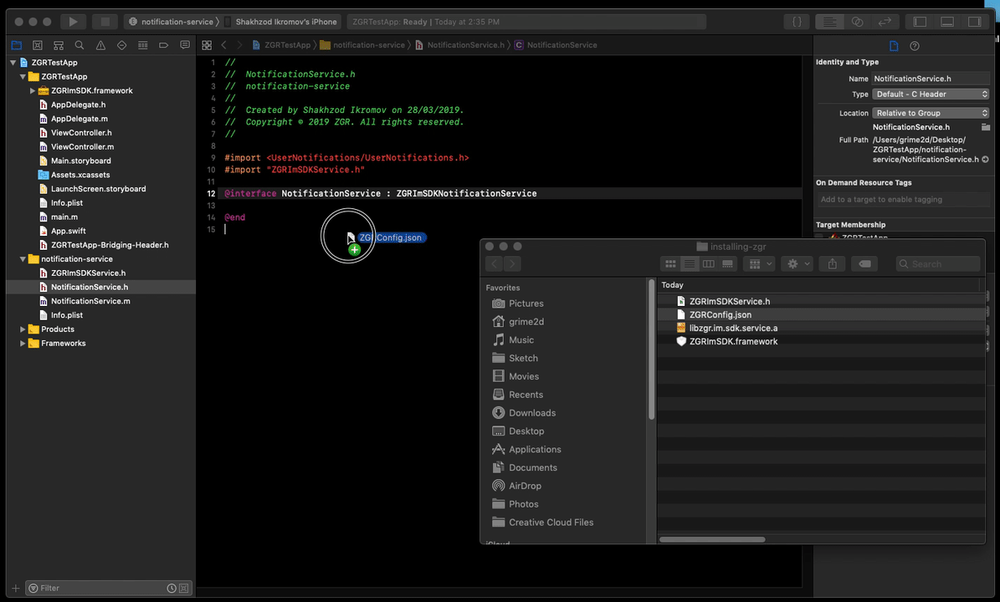

# Installation instructions for customers

## Setup

1. Для сборки вам потребуются сборка ZGR framework и config файлы.


2. Откройте Xcode и установите сборки framework'а в ваше прилоежние перетащив их в среду. Отметье опцию «Copy items if needed».
    * Убедитесь, что framework встроится в ваше приложение (embedded).


3. Внутри `AppDelegate` импортируйте ZGR

Objective-C:

```
#import <ZGRImSDK/ZGRImSDK.h>
```
   
Swift:

```
import ZgrImSDK
```

4. Register your app for remote notifications and send token to ZGR

Objective-C:

```
- (BOOL)application:(UIApplication *)application didFinishLaunchingWithOptions:(NSDictionary *)launchOptions {
    [application registerForRemoteNotifications];
    return YES;
}

- (void)application:(UIApplication *)application didRegisterForRemoteNotificationsWithDeviceToken:(NSData *)deviceToken {
    [[ZGRMessaging sharedInstance] registerForRemoteNotifications:deviceToken];
}
```
 
Swift:

```
    func application(_ application: UIApplication, didFinishLaunchingWithOptions launchOptions: [UIApplication.LaunchOptionsKey : Any]? = nil) -> Bool {
        application.registerForRemoteNotifications()
        return true
    }

    func application(_ application: UIApplication, didRegisterForRemoteNotificationsWithDeviceToken deviceToken: Data) {
        ZGRMessaging.sharedInstance().register(forRemoteNotifications: deviceToken)
    }
```

5. Имплементируйте UNNotificationCenter и требуемые делегаты.

Objective-C:

```
#import <UserNotifications/UserNotifications.h>

@interface AppDelegate () <UNUserNotificationCenterDelegate>
@end 

...

- (BOOL)application:(UIApplication *)application didFinishLaunchingWithOptions:(NSDictionary *)launchOptions {
    [application registerForRemoteNotifications];
    [UNUserNotificationCenter currentNotificationCenter].delegate = self;
    [[UNUserNotificationCenter currentNotificationCenter] requestAuthorizationWithOptions:UNAuthorizationOptionAlert | UNAuthorizationOptionSound | UNAuthorizationOptionBadge
                                                                        completionHandler:^(BOOL granted, NSError * _Nullable error) {

                                                                        }];
    return YES;
}

```
    
Swift:

```
TO BE DONE
```

6. Направьте обработку нотификаций в ZGR

Objective-C:

```
- (void)userNotificationCenter:(UNUserNotificationCenter *)center didReceiveNotificationResponse:(UNNotificationResponse *)response withCompletionHandler:(void (^)(void))completionHandler {
    if ([[ZGRMessaging sharedInstance] userNotificationCenter:center didReceiveNotificationResponse:response withCompletionHandler:completionHandler]) {
        return;
    }

    // Here goes my own code. It will reach here if ZGR did already handle notification tapping
}
```

Swift:

```
TO BE DONE
```


7. Создайте нотификационный сервис, если он ещё не создан


8. Подключите framework c notification service


9. Устновите root вашего проекта на предоставляемый framework'ом ZGR


10. Подключите ваш config файл




# Известные ограничения

В настоящий момент framework не поддерживает эмулятор. Используйте физические устройства.
